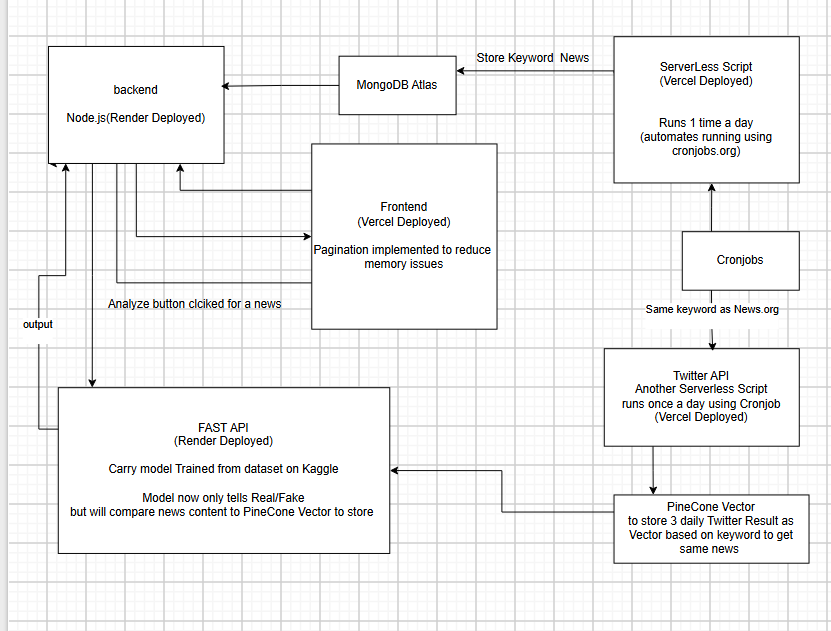

# 📰 Fake News Detection & Automated News Pipeline

## 📌 Overview
This project is a **full-stack Fake News Detection System** that integrates multiple services to automate **news collection, analysis, and verification**.  

The system uses a **Machine Learning model** trained on a Kaggle dataset to predict whether a news article is **Real** or **Fake**.  
Link: https://news-letter-automated.vercel.app/
### 🚀 Technologies Used
- **Frontend:** React / Next.js → Deployed on Vercel  
- **Backend API:** Node.js + Express → Deployed on Render  
- **ML Model API:** FastAPI + Pickle Model → Deployed on Render  
- **Database:** MongoDB Atlas  
- **Automations:** Serverless Cron Jobs (Vercel + cronjobs.org)  
- **Vector Search:** Pinecone (for news similarity)  
- **External APIs:** Twitter API, News API  

---

## ⚙️ System Architecture

### Flow Overview
1. **Frontend (Vercel)**
   - Displays news articles with pagination.
   - Users can click **Analyze** on a news article.
   - Sends request to Node.js Backend.

2. **Backend (Node.js + Express, Render)**
   - Provides APIs:
     - `/news` → Fetch stored news from MongoDB.
     - `/analyze` → Forwards text to FastAPI ML model for classification.
   - Stores and retrieves news from **MongoDB Atlas**.

3. **ML Model API (FastAPI, Render)**
   - Loads trained Fake News detection model (`.pkl`) from Kaggle dataset.
   - Exposes `/predict` API → returns:
     ```json
     { "prediction": "Real" , "Fake" }
     ```
   - (Planned) Checks news similarity using **Pinecone Vector DB**.

4. **Automated News Fetching**
   - Serverless Script (Vercel) → triggered daily via cronjobs.org:
     ```
     https://news-letter-automated-whhy.vercel.app/api/fillNewNews
     ```
   - Fetches news via external News API.
   - Stores new articles in MongoDB.

5. **Twitter Integration**
   - Serverless Script (Vercel) → triggered daily via cronjobs.org:
     ```
     https://news-letter-automated-whhy.vercel.app/api/fetchTweetsToPinecone
     ```
   - Fetches tweets for relevant keywords.
   - Stores vectors in **Pinecone** for similarity search.

6. **Pinecone Vector DB**
   - Stores **3 news a day Twitter data vectors**.
   - Enables semantic similarity search to detect if news is circulating on Twitter.

---

## 📂 Project Structure


## Website Working


## Phone Working


